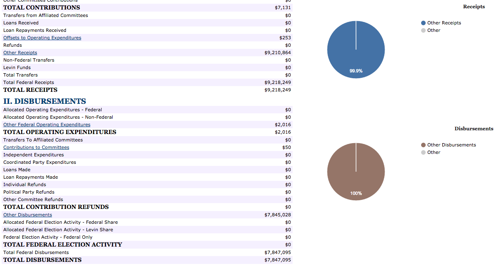
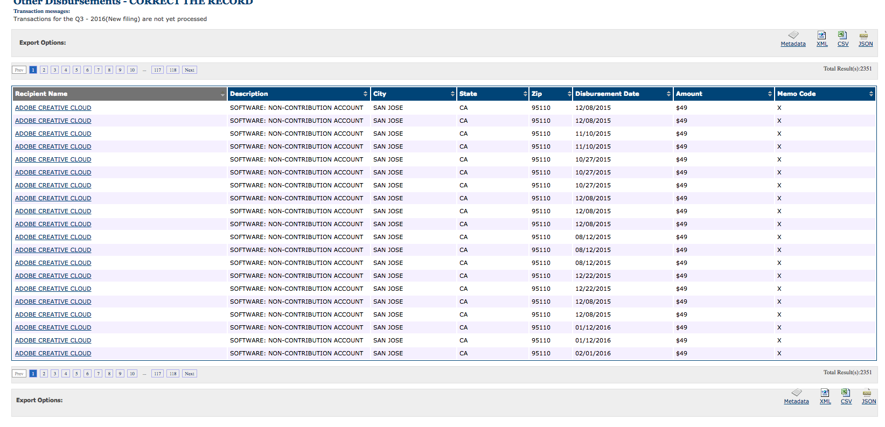
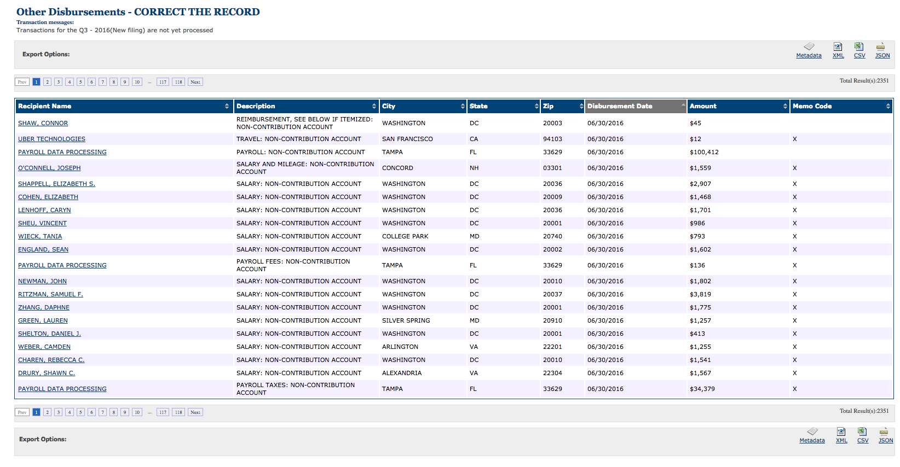

http://www.factcheck.org/2016/01/correct-the-record/

https://www.washingtonpost.com/news/post-politics/wp/2015/05/12/how-a-super-pac-plans-to-coordinate-directly-with-hillary-clintons-campaign/

http://www.fec.gov/fecviewer/CandidateCommitteeDetail.do?candidateCommitteeId=C00578997&tabIndex=1

> But Correct the Record believes it can avoid the coordination ban by relying on a 2006 Federal Election Commission regulation that declared that content posted online for free, such as blogs, is off limits from regulation. The “Internet exemption” said that such free postings do not constitute campaign expenditures, allowing independent groups to consult with candidates about the content they post on their sites. By adopting the measure, the FEC limited its online jurisdiction to regulating paid political ads.

# Future45

http://www.wsj.com/articles/sheldon-adelson-in-talks-to-create-pro-trump-super-pac-1464721696
https://www.theguardian.com/us-news/2016/sep/23/sheldon-adelson-trump-super-pac-donation-25-million

http://www.fec.gov/fecviewer/CandidateCommitteeDetail.do?candidateCommitteeId=C00574533&tabIndex=3

# Koch brothers

https://www.opensecrets.org/pacs/superpacs.php

http://www.mcclatchydc.com/news/politics-government/election/article85052332.html

> Unlike ordinary PACs, which are bound by restrictions on contributions, super PACs can receive unlimited contributions so long as the PAC does not give money directly to a candidate or coordinate with a candidate how it spends its money.

https://www.opensecrets.org/pacs/pacgot.php?cycle=2016&cmte=C00236489

http://www.fec.gov/fecviewer/CandidateCommitteeDetail.do?candidateCommitteeId=C00236489&tabIndex=3

http://www.rollcall.com/news/politics/koch-brothers-plan-another-4-million-in-senate-ads

> The spending was debuted at Charles and David Koch's donor retreat over the weekend. The Koch brothers have refused to spend on behalf of Donald Trump, choosing instead to pour their resources into Senate contests.  

https://www.opensecrets.org/pacs/lookup2.php?strID=C00564765

----------

Democrats

https://www.washingtonpost.com/graphics/politics/superpac-donors-2016/

https://www.washingtonpost.com/politics/how-10-mega-donors-already-helped-pour-a-record-11-billion-into-super-pacs/2016/10/05/d2d51d44-8a60-11e6-875e-2c1bfe943b66_story.html

----------

http://www.bloomberg.com/politics/graphics/2016-presidential-campaign-fundraising/

----- 

Check priorities USA

http://www.politico.com/story/2016/10/priorities-usa-action-raised-246-million-last-month-230131
