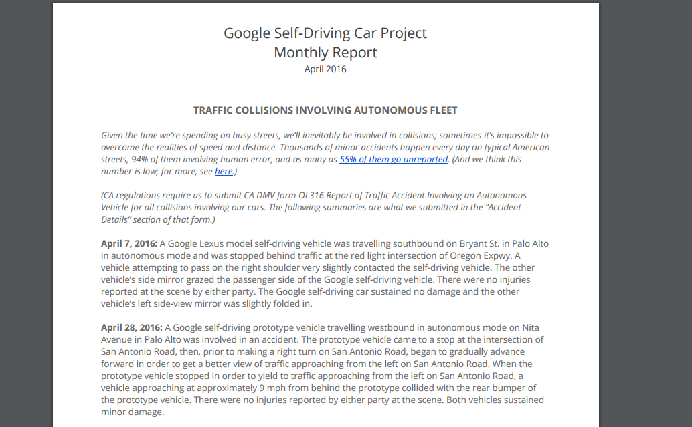
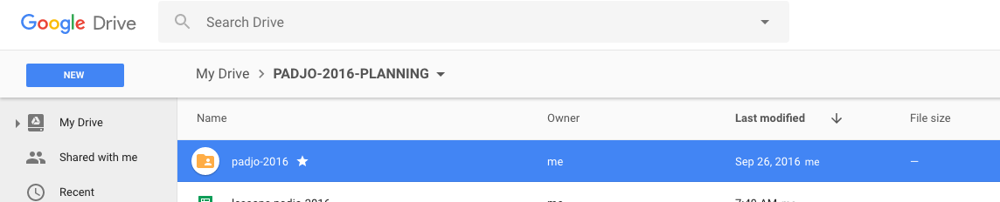
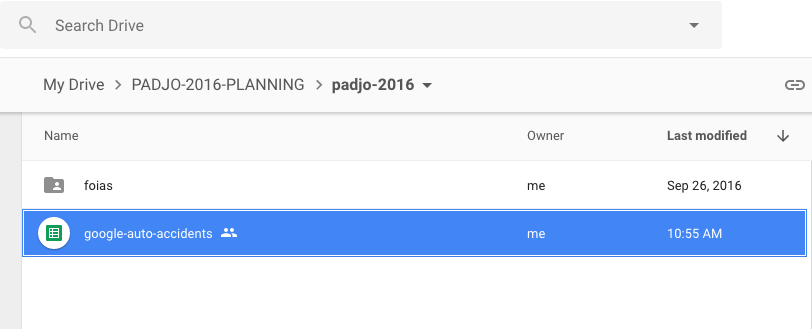
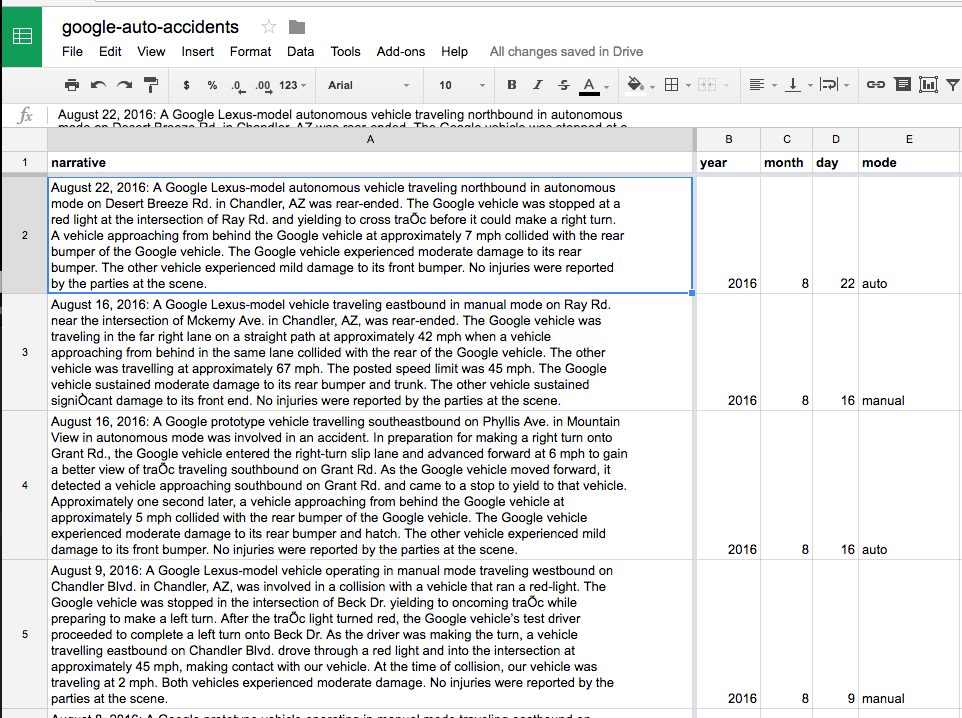
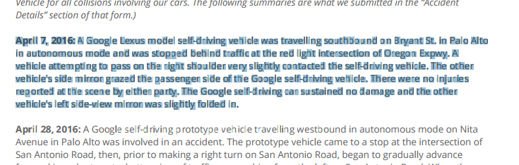

# Background

Just a few days ago, a Google autonomous Lexus was reportedly involved in one of the [self-driving program's worst accidents yet](https://9to5google.com/2016/09/23/googles-self-driving-car-was-today-in-what-appears-to-be-its-worst-accident-yet/). 

But when we read the actual article, the damage doesn't live up to the title. The Google car's door is caved in, but no injuries were reported. So if that is Google's "worst" crash, then what were its other accidents like? And if none of them are bad, then maybe we have little to fear. [A Google spokesperson told 9To5Google](https://9to5google.com/2016/09/23/googles-self-driving-car-was-today-in-what-appears-to-be-its-worst-accident-yet/) that not only was the wreck the fault of the other driver, the vast majority of urban crashes are through human error.

OK...but now we need to know how many accidents _period_ there have been, and then, how many were the fault of the autonomous vehicle's algorithm.

The California DMV requires drivers to report accidents. But Google goes a step further and provides a page of reports:

[https://www.google.com/selfdrivingcar/reports/](https://www.google.com/selfdrivingcar/reports/))

# The plural of anecdote is data

Unfortunately, while there is _data_, it's not _structured data_. It's just a bunch of narrative prose:

So we have to crawl through more than a dozen PDFs  to read every incident. And then we have to manually enter each attribute/column value for every accident.

Heck, even before that, we have to know the data well enough to know what's worth recording. 

So For our first assignment, we tackle the hardest kind of problem: extracting data _manually_, and counting what's important to us. That's a romantic way of describing the fun of __data entry__, but it will be good practice while also introducing us to the hardest concepts of data journalism. 

Why can't Google just make it easy? Maybe they have and I haven't seen it. But as you get more comfortable with data, you'll understand that data isn't just _born_. Someone has to want to count it. Just be relieved that there are only about 30 things to count here...

# More setup instructions

Assuming the battery of requirements and deliverables above is confusing, here's some pictures and more narrative.

Check out my Google Drive and how I have a folder named `padjo-2016`:

Inside that folder, I've made a new Google Spreadsheet named exactly `google-auto-accidents`:

And here's what part of my spreadsheet looks like:

You can copy the structure that I have, but keep in mind you need __3 more columns__, i.e. 3 more observations about each accident.

# What columns are worth recording?

If this is confusing to you, then don't feel bad: this is deliberately the hardest part of the exercise and is representative of the hardest concepts in this entire course: *There is no one way to count and observe something*.

Mostly, it's hard because a computer can't solve it for you. So, to solve it for yourself, consider:

- What attributes (i.e. column values) are easy to extract and write down?
- What attributes are most common across all the accidents?

In general, the most interesting attributes are also the hardest to quantify. As for which attributes are most relevant to the most accident events, it's worth reading a few of them to see how consistent and *inconsistent* the Google report writer is.

## Questions to have in mind

The goal of this assignment is to not write a news story...but what if it _were_ the requirement? Think of the kinds of things the reader would want to know about the data. Obviously, how many accidents Google has had is key, and you get that as just filling out the rows.

What about the incident with the most damage? That means creating a column in which you list the damage reported (and note that it's Google's choice on how to describe the damage). Injuries? Same thing. Plenty of readers probably want to know, "So how many orphans have Google's Skynet cars crippled this year?"

What you believe is important to answer is what you will take the time to track.

# Example of articles about the Google self-driving accident data

- [Official homepage of Google self-driving reports](https://www.google.com/selfdrivingcar/reports/)
- [Silk Visualization of partial accident data](https://google-self-driving-car-incidents.silk.co/)
- [Google self-driving car gets rear-ended in 13th accident since 2009](http://arstechnica.com/tech-policy/2015/06/google-self-driving-car-gets-rear-ended-in-13th-accident-since-2009/)

# The reports

Here are all the reports to read. There's a lot of them, so aim for _efficiency_.

- [August 2016](https://www.google.com/selfdrivingcar/files/reports/report-0816.pdf)
- [July 2016](https://www.google.com/selfdrivingcar/files/reports/report-0716.pdf)
- [June 2016](https://www.google.com/selfdrivingcar/files/reports/report-0616.pdf)
- [May 2016](https://www.google.com/selfdrivingcar/files/reports/report-0516.pdf)
- [April 2016](https://www.google.com/selfdrivingcar/files/reports/report-0416.pdf)
- [March 2016](https://www.google.com/selfdrivingcar/files/reports/report-0316.pdf)
- [February 2016](https://www.google.com/selfdrivingcar/files/reports/report-0216.pdf)
- [January 2016](https://www.google.com/selfdrivingcar/files/reports/report-0116.pdf)
- [December 2015](https://www.google.com/selfdrivingcar/files/reports/report-1215.pdf)
- [November 2015](https://www.google.com/selfdrivingcar/files/reports/report-1115.pdf)
- [October 2015](https://www.google.com/selfdrivingcar/files/reports/report-1015.pdf)
- [September 2015](https://www.google.com/selfdrivingcar/files/reports/report-0915.pdf)
- [August 2015](https://www.google.com/selfdrivingcar/files/reports/report-0815.pdf)
- [July 2015](https://www.google.com/selfdrivingcar/files/reports/report-0715.pdf)
- [June 2015](https://www.google.com/selfdrivingcar/files/reports/report-0615.pdf)
- [May 2015](https://www.google.com/selfdrivingcar/files/reports/report-0515.pdf)

## How to be efficient

My advice is to do one thing at a time, and the most important thing you need to do is get all the narratives in one place. I started off by creating a column for "narrative". Then I switched back to the PDF, mouse-drag-highlighted the text of each narrative:

Then, with the magic of Command-C, copied the text to clipboard. Switched back to my spreadsheet. Double-clicked an empty `narrative cell`, and hit Command-V to paste,

I took the time to record the year, month, and if possible, the day, from each incident, since it's simple enough and the narrative text may not itself contain the year and month. And since it's easy enough, I recorded the `mode` that the car was in during the accident:

Then I started recording the year, month, and day, as separate columns, and finally, a column for the `mode`: e.g. `auto` or `manual`:

