Visit the History menu:

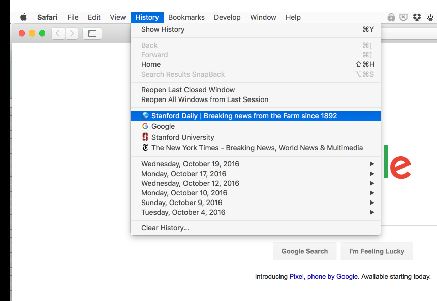

Expand a date:

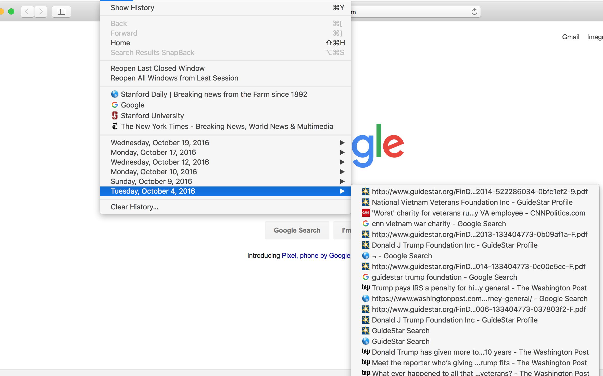

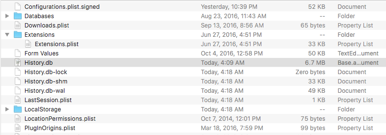

### small features

#### Search bar

Filtering for `"stanford"`:

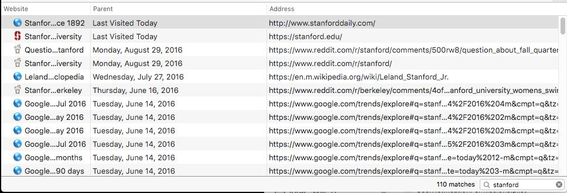

#### Clear history

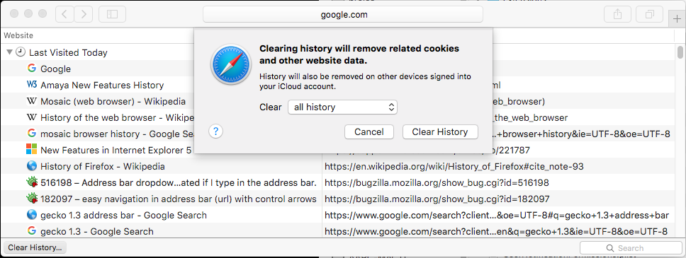

Before clearing it, I'm going to navigate to my directory from the __Finder__:

- Activate the __Go to folder__ action using the keyboard-shortcut: `Command+Shift+G`
- Specify this path, exactly: `~/Library/Safari`

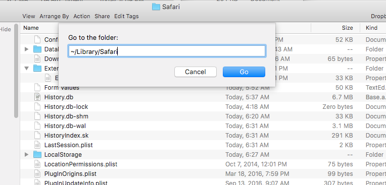

The contents of your folder, `~/Library/Safari`, should look similar to mine:

WARNING: the subfolders are a different story. They can contain files specific-- and _named_ for -- the websites you've visited. Because the History database is just one way that your browser tracks your activity...

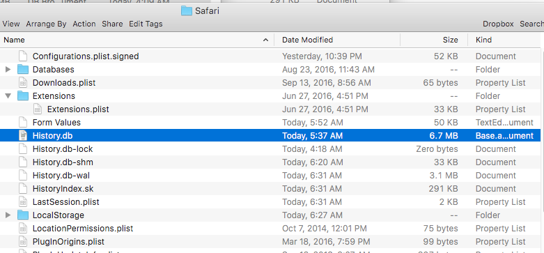

My Finder is set to list files as a list, including their __file size__. The `History.db` file is what we care about. But before we open it as a database, observe its size: `6.7MB`. The size of a database is dependent both on number of rows and amount of content per row, but it's safe to assume that there are thousands of records in my `History.db`.

If you're following along, I suggest making a copy of `History.db`, just in case you don't want to wipe it out and you want to see what your history consists of so far:

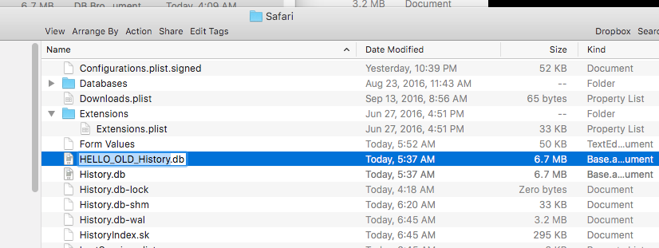

### Cleaning history

Switching back to the History panel of Safari. I'm going to push the button to wipe out my entire browser history:

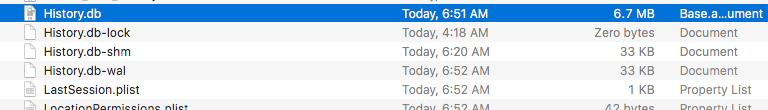

Hmmm...the `History.db` file is _still there_. More importantly, it contains just as many megabytes as it did before. We expect that `History.db` be wiped out, or at least reduced to a filesize reflecting the emptiness of its contents.

This is troublesome. But do one more thing: Quit Safari (Keyboard shortcut: `Command-Q`). No file size change.

Re-open Safari. Re-open History. At least the panel _seems_ to reflect an empty slate:

##### What Chrome and Safari think about humans and time

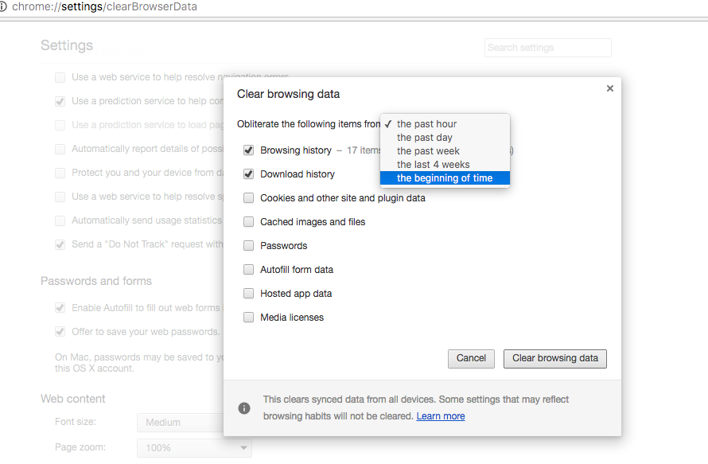

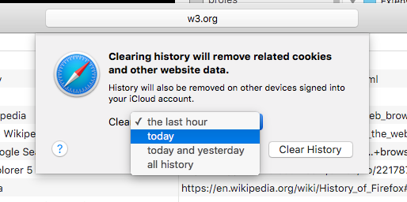

Chrome history clearing

